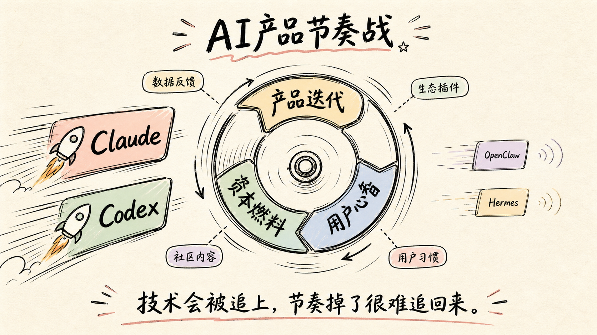

AI 现在最狠的竞争，不是模型参数，而是节奏感。

Claude 和 Codex 这两家，已经进入你发一个新功能，我马上跟一个更狠版本的状态。用户当然爽，体验被逼着往前走，能力上限也被一轮轮抬高。

但你再看 OpenClaw 和 Hermes，前阵子还有声量，最近明显安静了。不是说它们不行，而是在这个赛道里，安静本身就很危险。

AI 产品的窗口期太短了。你慢一拍，用户注意力就被别的新东西拿走。你停几周，别人可能已经完成一轮功能、体验和心智占位。

这里面也不只是业务能力的竞争，还是资本的博弈。

现在大家主要还是在烧钱。算力要钱，模型训练要钱，工程团队要钱，补贴用户和生态也要钱。谁背后的资金更厚，谁就更能把高频迭代撑下去，把用户的预期不断往上抬。

更麻烦的是，一旦头部玩家把节奏跑起来，后面追的就不只是技术差距了。还有用户习惯、数据反馈、生态插件、社区内容，以及资本市场对赢家的预期，所有东西都会一起滚。

我越来越觉得，AI 这场仗拼的不只是聪明，也不只是业务执行，而是谁有足够的资源，持续出现在用户面前。

技术会被追上，节奏掉了就很难追回来。

## 质检报告

**L1 硬性规则** ✅
- 禁用词：0 处命中
- 禁用标点：正文 0 处命中
- 结构套话：0 处命中
- 空泛工具名：0 处
- 长度：✅，约 610 字符
- 结尾陈词滥调：0 处命中
- 表演式话术：0 处命中
- 段落结构：✅

**L2 风格一致性** ✅
- 开头钩子：✅
- 节奏：✅
- 口语化与情绪：✅
- 标点禁令二次确认：✅
- 信息密度：✅

**L3 活人感** ✅
- 温度感：✅
- 独特性：✅
- 姿态：✅
- 心流：✅
- 会不会转：✅

**总评**：3 层全部通过
