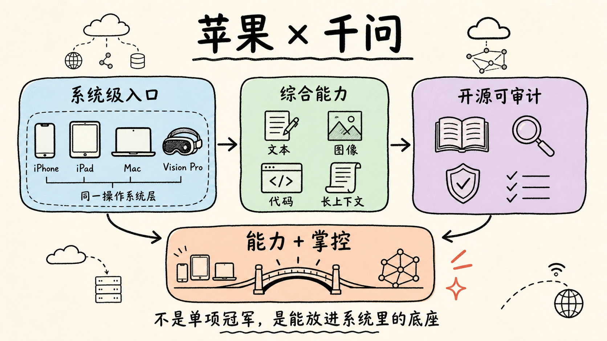

苹果选千问，最有意思的点，不是阿里又拿了一个大单，而是苹果在中国市场终于找到了一个它能接受的 AI 底座。

它要的不是单项冠军。

系统级 AI 要覆盖写作、图片理解、内容生成、跨 App 调用、设备侧体验，任何一块短板都会被用户直接感知。千问的优势刚好不是某一项特别炫，而是文本、图像、代码、长上下文都在第一梯队，综合分够稳。

但我觉得更关键的是开源。

苹果这种公司不会只看模型跑分。它更在意能不能审计、能不能控制、能不能把安全边界讲清楚。千问开源做得足够彻底，生态也足够活跃，这对苹果是信任基础，不只是技术选型。

所以这次合作真正有意思的地方在这里。

千问给苹果补上中国 AI 能力，苹果给千问一个系统级入口。一个要能力，一个要掌控，两边刚好扣上了。

## 质检报告

**L1 硬性规则** ✅
- 禁用词：0 处命中
- 禁用标点：0 处命中
- 结构套话：0 处命中
- 空泛工具名：0 处
- 长度：✅，约 335 字符
- 结尾陈词滥调：0 处命中
- 表演式话术：0 处命中
- 段落结构：✅

**L2 风格一致性** ✅
- 开头钩子：✅
- 节奏：✅
- 口语化与情绪：✅，表达克制
- 标点禁令二次确认：✅
- 信息密度：✅

**L3 活人感** ✅
- 温度感：✅
- 独特性：✅
- 姿态：✅
- 心流：✅
- 会不会转：✅

**总评**：3 层全部通过
**修复优先级**：暂无
