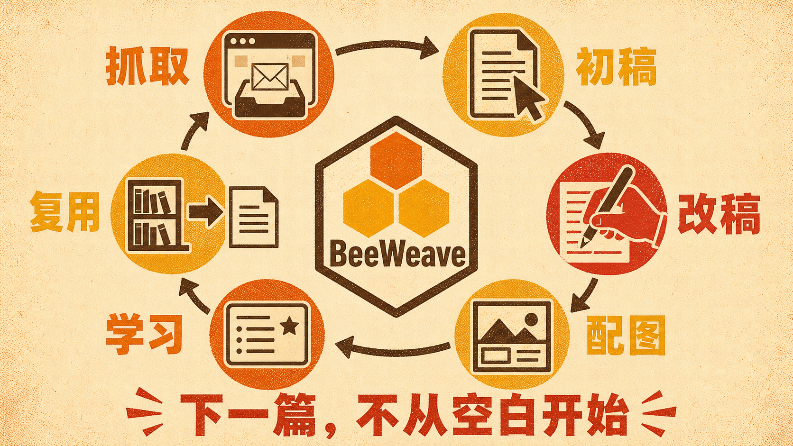
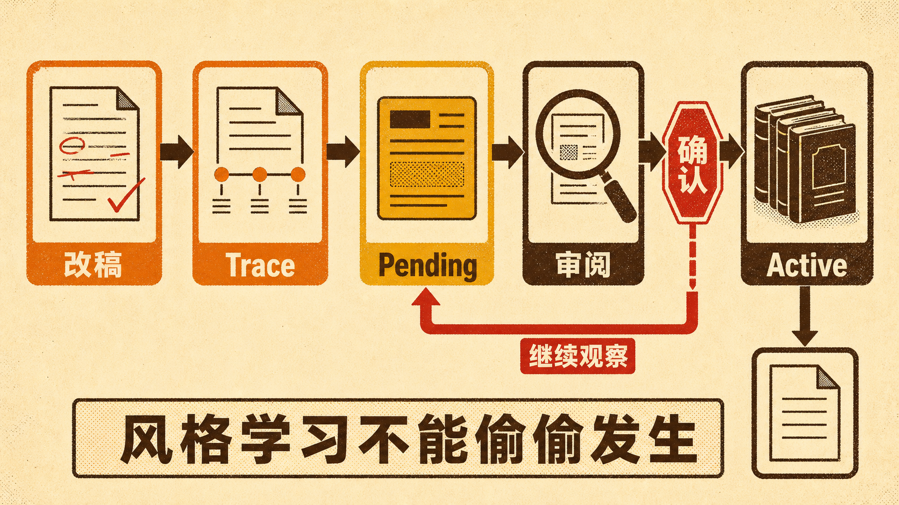
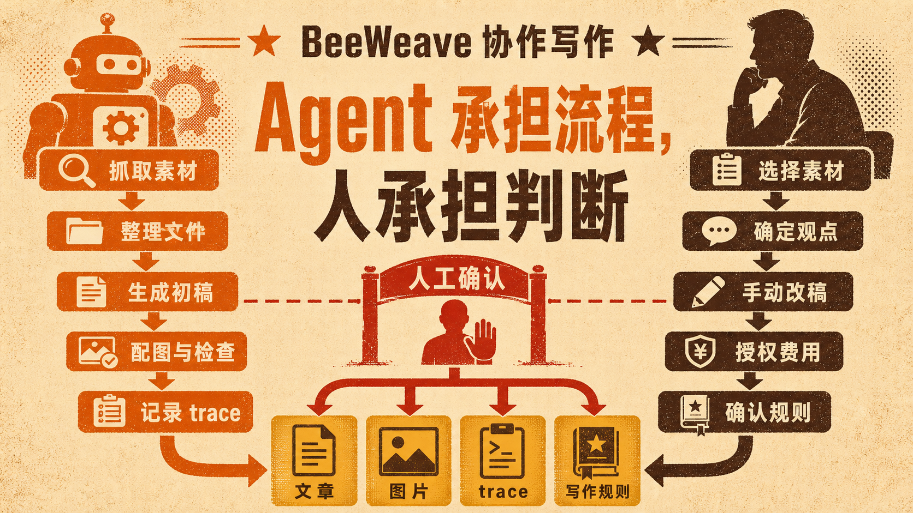
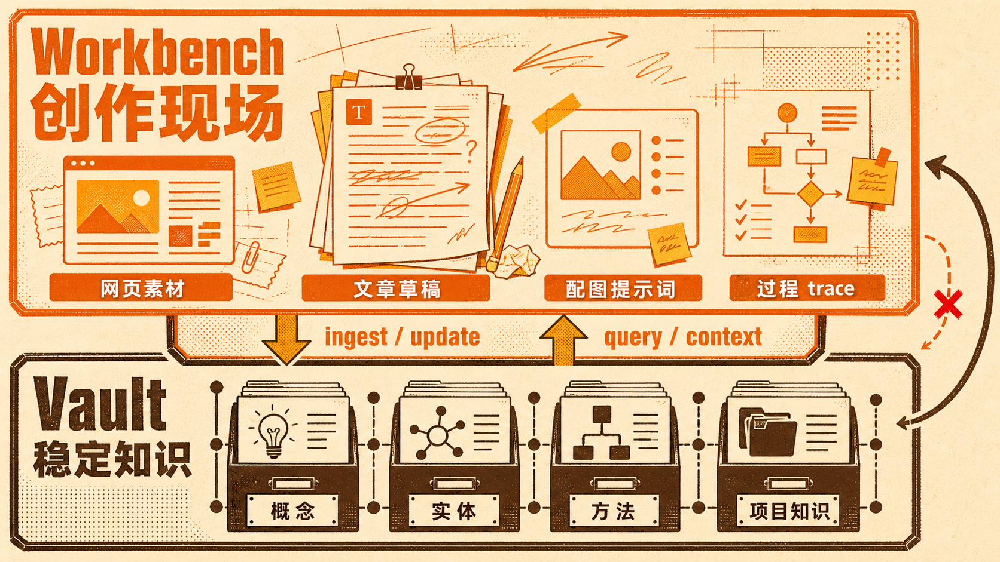

# 我用 BeeWeave 跑完了一次完整写作闭环

今天下午，我在知乎上看到一篇讨论一人公司创业风险的回答。

文章里有一句话，我觉得特别准确。

AI 降低的是做软件的门槛，不是做生意的门槛。

我想围绕这个判断写一篇短文。于是我把知乎链接丢给 BeeWeave，让它抓取正文、整理素材、生成草稿。写完之后，我自己改了开头，加了一句更有力量的判断，又把一段挤在一起的问题拆成短清单。

接着，我让 BeeWeave 为文章生成一张宣传图。它安装配图依赖，检查图片模型配置，先做一次小图探测，再根据文章主旨生成一张 16 比 9 的复古海报，最后把图片插回 Markdown。

事情到这里其实已经可以结束了。

但我又做了一步。我让 BeeWeave 对比初稿和我的手动改稿，把这次修改沉淀成写作风格候选，再经过审阅、确认，把其中稳定的部分写进我的个人风格规则。

一条知乎链接，最后变成了一篇短文、一张宣传图、一份完整过程记录，以及两条以后还能继续使用的写作规则。

这就是我最近一直在做的 BeeWeave。

它不只是帮我写一篇文章。它想解决的是另一个更麻烦的问题，怎么让一次创作，变成下一次创作的起点。

项目地址在这里。

https://github.com/ptonlix/beeweave

## 我以前缺的不是 AI，而是一张能持续工作的桌子

现在用 AI 写东西已经不难了。

打开一个聊天窗口，贴一段资料，告诉模型帮我写一篇文章。几分钟后，一篇结构完整、语句通顺的稿子就出来了。

真正麻烦的部分，通常发生在聊天窗口之外。

原始资料放在哪里？抓取网页时有没有混进无关内容？初稿和改稿是什么关系？配图提示词有没有保存？文章发布以后，哪些表达是我真正喜欢的？下一次写作时，模型还记不记得我删掉了什么、保留了什么？

如果这些问题没有答案，AI 每次都像一个刚入职的新同事。

它可以很聪明，但它不知道上次发生了什么。

作者也一样。每写一篇文章，都要重新翻链接、找文件、解释风格、复制提示词。文件散在下载目录、聊天记录、笔记软件和不同项目里，写作看起来自动化了，写作系统却没有建立起来。

我缺的不是另一个更会续写的输入框。

我缺的是一张能持续工作的桌子。

素材来了，有地方放。写作开始了，有流程可走。人改过什么，有记录可查。成熟知识形成了，有稳定的地方沉淀。下一次 Agent 开始工作时，又能把这些上下文重新拿回来。

BeeWeave 就是我为这张桌子做的工具。

## 从一条知乎链接开始

这次真实流程的起点很简单，就是一条知乎回答链接。

我调用了 BeeWeave 的网页抓取能力。系统没有把网页内容直接塞进知识库，而是先保存到 `workbench/inbox/web/`。这里是素材入口，允许内容保持原始、粗糙，甚至带着网页噪声。

这个边界挺重要。

互联网上抓下来的东西只是素材，不是知识，更不是指令。它需要先被检查、整理和判断，才能进入后面的写作过程。

知乎页面本身也给了一个很典型的例子。第一次提取时，页面里混进了同一个问题下的其他回答。如果只看标题和摘要，很容易误以为抓取成功了。BeeWeave 继续检查目标 answer id、作者和正文标记，最后从页面的结构化数据里只取出指定答主的内容，剔除了其他回答。

最终保存的不只是一个 Markdown 文件。

目录里还有网页快照、结构化文档和请求记录。正文可以直接阅读，原始页面也能在需要时回查。

我很喜欢这种处理方式。因为自动化不是把过程藏起来，而是把重复劳动交给机器，同时保留作者检查事实的入口。

素材进了 inbox，创作才真正开始。

## AI 先写，人再把文章拿回来

接下来，我让 BeeWeave 根据抓取到的素材写一篇不少于 500 字的短博文，回答一人公司创业中最大的风险是什么。

系统先读取我的共享写作风格资产，包括作者画像、生效规则、反模式和社交内容规则。然后它从原文的获客、需求验证、反馈缺失、Demo 与产品之间的差距里，提炼出一条更集中的主线。

一人公司最大的风险，不是做不出产品，而是高效地做出一个没人愿意买的产品。

这个角度没有照抄原文，也没有把六个观点机械压缩成六条摘要。它抓住了整篇素材里最有张力的矛盾，AI 让生产越来越快，商业验证却不会自动发生。

初稿被保存到 `workbench/articles/drafts/`，同时创建了一份 trace。trace 不复制整篇文章，而是记录这次任务用了什么素材、生成了哪个文件、当前版本是什么、发生过哪些修改。

然后轮到我了。

我在正文里做了几处手动修改。

我把开头改成「最近看到的一人公司创业中」，保留它来自一次真实阅读。我又加入一句独立成段的金句。

AI 降低的是做软件的门槛，不是做生意的门槛。

我还把原来挤在一个长句里的需求验证问题拆成三条短清单，让读者可以快速核对。

这些改动不大，却决定了文章是不是我的。

我一直觉得，写作自动化最危险的误区，就是把作者从流程里拿掉。AI 可以整理结构、压缩素材、检查语言，但核心判断、真实经历和最终取舍必须由人完成。否则得到的只是平均正确的文字，不是作者愿意承担的表达。

BeeWeave 的工作方式不是把我替换掉，而是把我放在几个真正重要的节点上。

选什么素材，表达什么判断，改掉哪些句子，哪一版可以被学习，都由我确认。

## 配图也不该是一场失忆的抽奖

文章写完以后，我想为它做一张宣传图。

这一步平时也很容易碎掉。你可能在另一个图片工具里临时写一段提示词，生成几张图，下载其中一张，随手改个文件名，然后再回到文章里插入。

过几天想重做，提示词找不到了。换一个图片模型，也不知道上次到底用了什么比例、风格和配置。

BeeWeave 把配图也放进同一个文章目录里处理。

系统先检查 `baoyu-article-illustrator` 和 `baoyu-image-gen` 两个上游能力是否存在，再把它们安装到用户级 external 目录，链接到当前项目。图片 provider、模型、比例、质量和风格都写在项目级配置中，API 密钥则单独保存在不应提交的环境文件里。

正式生成前，它先运行不扣费的 doctor，检查依赖、运行器、provider、模型和凭证是否齐全。配置通过以后，我又明确授权了一次真实小图探测。探测成功，才开始生成正式宣传图。

这种步骤看起来比直接点生成多了一点，但我反而更放心。

因为图片生成会产生费用，也可能在接口、模型或下载环节失败。先验证，再生成，比扣完费才发现配置错了靠谱得多。

配图阶段还做了两件我很在意的事。

它把原来散落在 drafts 目录里的 Markdown 移进文章专属目录，避免不同文章共用一个 `imgs/`。然后先写 `outline.md` 和独立的 prompt 文件，再调用图片模型。

也就是说，图片不是只留下一个 PNG。它的视觉意图、构图、颜色、文字和生成参数都能追溯。

这次我选择的是左右对比的 screen-print 海报。左边是高速运转的 AI 生产线，中间是一道风险裂缝，右边是冷清的市场和稀少的付款信号。图片生成后，系统检查了尺寸、文件完整性和中文字，再把相对路径插回文章。

文章、图片、配图大纲和提示词，最后待在同一个目录里。

这才像一个完整的创作项目。

## 最关键的一步，是让改稿变成下一次的能力

如果 BeeWeave 只做到素材管理、写稿和配图，它已经是一个还不错的创作工作台。

但我真正想做的，是后面这一步。

文章完成后，我调用 writing style learner，让系统复盘这次改稿。它读取当前成稿、原有风格规则和 trace，判断哪些变化是 AI 自己做的，哪些是我明确要求的，哪些是我亲手改的。

不同信号的权重不一样。

AI 自己润色了一句，只能算弱观察。用户明确要求换开头，是强信号。用户亲手改完并确认采用，更值得被学习。

这次系统识别出了两处手动改稿。

一处是我在开头加入独立的对照式金句，用一句更短的话钉住全文矛盾。另一处是我把复杂判断拆成局部短清单，让读者更容易扫读。

学习器没有把一次修改直接写成永久规则。它先把候选放进 `pending_rules.md`，附上证据、置信度和后续验证方式，同时把这篇文章登记为社交短文样例。

然后我调用 writing skill evolver 进行审阅。

它检查候选是否与现有规则重叠，有没有被拒绝过，证据够不够，适合写在路由层、指令层还是资源层。审阅结果认为，独立金句可以形成一条新的社交写作规则，局部短清单则应该合并进原有的短段落规则，作为一个受限例外。

最后，在我明确确认以后，规则才被激活。

这里面有一个我很看重的设计。

风格学习不能偷偷发生。

如果模型看到一次修改就擅自总结「你永远喜欢这样写」，个人风格很快会被偶然偏好和错误归纳污染。BeeWeave 把学习、审阅、激活拆开，中间保留证据和人工确认，让风格演进可以追溯，也可以回滚。

写完一篇文章，系统不只是多了一篇文件。

它真的学会了一点东西。

## 这套自动化到底自动了什么

回看整条链路，BeeWeave 自动化的并不是创意本身。

它自动化的是那些容易遗失、重复又必须做对的环节。

网页正文被抓取并保存，目标内容经过检查。素材进入 inbox，而不是污染长期知识库。写作技能加载已有风格规则，生成草稿并建立 trace。配图技能管理依赖、配置、费用门禁、提示词和文件路径。学习器从改稿里提炼候选，进化器负责审阅、合并、激活和记录回滚方法。

作者仍然负责最重要的部分。

我为什么要写这件事，我相信哪个判断，我愿意保留哪句话，生成图片是否值得付费，这次改动是不是长期偏好。

这是一种我更愿意接受的写作自动化。

不是一键生成，然后把一堆文字扔给我。

而是 Agent 承担流程，人承担判断。

## Workbench 和 Vault，是这套系统的两层记忆

BeeWeave 里有一个很基础的划分，workbench 和 vault。

workbench 是创作现场。网页抓取、临时素材、草稿、配图、提示词和待处理内容都可以放在这里。它允许混乱，因为创作本来就不是一开始便整整齐齐。

vault 是稳定知识层。经过提炼、能够复用、适合链接和查询的内容，才进入这里。

这两个目录看起来只是文件组织，背后其实是在区分两种认知状态。

一个想法刚出现时，它可能不完整，甚至是错的。你需要在 workbench 里试写、反驳、改稿、配图。等它逐渐稳定，才适合进入 vault，成为下一次研究和写作可以依赖的上下文。

如果所有东西一开始都进知识库，知识库会变成杂物间。如果所有东西永远只留在草稿里，创作经验又无法复用。

BeeWeave 想把两者接起来。

收集不是终点，写作也不是终点。成熟内容可以继续 ingest、update 或 synthesize，变成概念、实体、方法和项目知识。下一次再通过 query、digest 或 context pack 把它们带回任务现场。

这个循环跑起来以后，知识库不再只是存档。

它会参与下一篇文章的诞生。

## 我为什么把它做成 Agent Skills

BeeWeave 不是一个固定页面里的写作应用。它提供 `bwe` CLI、Agent Skills、工作区模板、浏览器抓取扩展，以及围绕知识库维护的一组流程。

我选择 Skills，是因为创作任务很难被一条固定流水线覆盖。

有时我只有一个网址，需要先抓取。有时我已经有完整素材，只想写文章。有时我要做社交短帖，有时要配图、发布、沉淀知识或复盘风格。不同任务可以调用不同 skill，但它们遵守同一套目录边界、文件落点和追踪规则。

这让 BeeWeave 可以和不同 Agent 协作，而不是绑死在某一个聊天产品里。

更重要的是，Skills 把方法写成了可执行规范。

网页素材应该落在哪里，何时需要人工确认，图片生成前如何检查费用风险，写作风格候选如何进入 pending，什么情况下可以激活，这些都不是临场发挥。

Agent 能力越强，我越觉得边界要写得越清楚。

不是为了限制它，而是为了让自动化真的能长期运行。

## 它还不是一个魔法按钮

我不想把 BeeWeave 说成一个装好就能自动写出爆款的东西。

它不是。

这次流程里也遇到了真实问题。知乎页面第一次抓取混入其他回答，需要继续定位目标正文。图片视觉检查服务临时返回 502，只能换成本地文件检查。正式生图第一次请求失败，第二次重试才成功。风格学习也不能只靠一次改稿，需要继续积累样本和 eval case。

这些摩擦没有消失。

BeeWeave 做的是让摩擦有记录、有恢复路径、有明确的下一步。失败不会只留在聊天记录里，成功也不会只剩一个无法复现的结果。

一开始搭建这样的工作流，肯定比直接打开聊天窗口多一些配置。你要理解 workbench 和 vault，要决定 provider，要维护自己的风格资产。

但当写作从偶尔生成一篇，变成长期创作，这些结构会慢慢显示价值。

因为你省下来的不只是几分钟。

你保存的是判断、过程和连续性。

## 一篇文章，不应该在发布那一刻死掉

我们经常把写作理解成一条单向路线。

找到素材，写完，发布，结束。

但真正有复利的创作，更像一个循环。

素材进入工作台，经过写作变成表达。人的改稿暴露真实偏好，配图让观点获得新的视觉形式。发布后的内容再被提炼成知识，知识和风格又回到下一次创作。

下一篇文章不是从空白页开始。

它站在上一篇留下的素材、判断、规则和知识上。

这也是 BeeWeave 这个名字背后的直觉。不同来源的线索像一根根散线，Agent、工具和人类判断把它们编织在一起。最后得到的不只是一篇文章，而是一张不断生长的知识网络。

今天这篇关于一人公司的短文，只是一个很小的例子。

一条链接被抓下来，一篇草稿被写出来，一处人工判断让它真正有了作者，一张图片让观点变得可见，一次学习又让系统在下一次写作时更懂我一点。

从素材到作品，再从作品回到能力。

这就是我想用 BeeWeave 跑起来的写作闭环。

如果你也在用 AI 做研究、写作和知识管理，欢迎来看看这个项目，试着把自己的创作桌子搭起来。

项目地址。

https://github.com/ptonlix/beeweave

## 质检报告

**L1 硬性规则** ✅
- 禁用词已扫描并修复
- 禁用标点已扫描并修复
- 无教科书式开头和机械总结
- 工具与 skill 均使用具体名称

**L2 风格一致性** ✅
- 从当天真实创作场景切入
- 使用二级小标题完成阅读分层
- 长短句交替，并有独立短句制造停顿
- 主线持续回扣写作闭环

**L3 内容质量** ✅
- 每个核心环节都有本次实际过程支撑
- 明确解释素材、写作、配图、学习与知识复用的关系
- 坦诚保留抓取污染、接口失败、配置成本等限制
- 每节都回到 BeeWeave 解决的具体问题

**L4 活人感** ✅
- 作者以亲自使用和改稿的视角展开
- 没有虚构人物、数据或体验
- 宣传来自真实过程，而不是功能堆砌
- 结尾回扣开头的一条链接与完整闭环

**总评**：4 层全部通过
