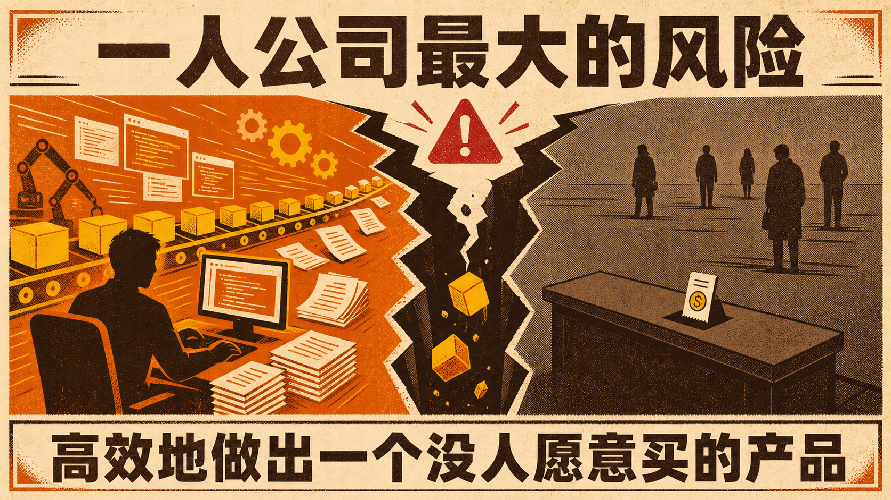

最近看到的一人公司创业中，最大的风险不是一个人干不过来，而是一个人做得太快，却迟迟没有碰到真实市场。

**AI 降低的是做软件的门槛，不是做生意的门槛。**

AI 把写代码、做设计、写文案、搭流程的门槛降了很多。过去需要一个团队才能完成的 Demo，现在一个人几天就能做出来。这很容易制造一种错觉，产品已经跑起来了，创业也在向前推进。

可创业真正困难的部分，从来不是把东西做出来，而是找到一个足够痛、有人愿意现在付钱、你又能够持续交付的需求。AI 可以帮你提高生产速度，却不能替你判断谁有预算、谁能拍板、谁只是随口提了一个想法。客户愿意免费试试，不等于需求成立。有人点赞，也不等于有人付钱。

更麻烦的是，快速生产会让人沉迷于一种舒服的忙碌。功能越加越多，页面越改越漂亮，自动化流程越搭越复杂，市场反馈却一直没有回来。看起来每天都在工作，其实是在用 Coding 逃避销售，用完善产品逃避验证需求。方向如果错了，效率越高，时间、现金流和注意力消耗得越快。

一人公司缺少同事、老板和合伙人的外部校准，这种偏差也更难被发现。连续几周没有订单时，一个人既要判断方向，也要消化焦虑，还要逼自己继续接触客户。AI 能陪你分析，却不能替你承担决策后果。没有反馈的阶段，往往比技术问题更消耗人。

所以，一人公司真正需要防范的，是在生产力暴涨之后，商业判断没有同步升级。

动手之前，可以先问几个很朴素的问题。

- 是否已经有人花钱解决，我能不能找到这些人对方能不能快速做购买决定
- 我有没有比普通从业者更深的场景认知
- 产品还不完美时，客户是否愿意为结果付费

这些问题没有答案，先别急着继续加功能。可以先做演示页、讲方案、找潜在客户聊，甚至先尝试收一笔小额费用。真实的咨询、报价和付款，比一百句听起来不错更有价值。

AI 让一个人拥有了过去一个团队的生产能力，但没有顺手赠送获客渠道、商业常识和情绪韧性。它让个人创业更可能，却没有让创业更轻。

一人公司最大的风险，不是做不出产品，而是高效地做出一个没人愿意买的产品。

## 质检报告

**L1 硬性规则** ✅
- 禁用词：0 处
- 禁用标点：0 处
- 结构套话：0 处
- 空泛工具名：0 处
- 长度：✅（正文约 780 字）
- 结尾陈词滥调：0 处
- 表演式话术：0 处
- 段落结构：✅

**L2 风格一致性** ✅
- 开头钩子：✅
- 节奏：✅
- 口语化与情绪：✅，以克制的判断为主
- 标点禁令二次确认：✅
- 信息密度：✅

**L3 活人感** ✅
- 温度感：✅
- 独特性：✅
- 姿态：✅
- 心流：✅
- 会不会转：✅

**总评**：3 层全部通过
