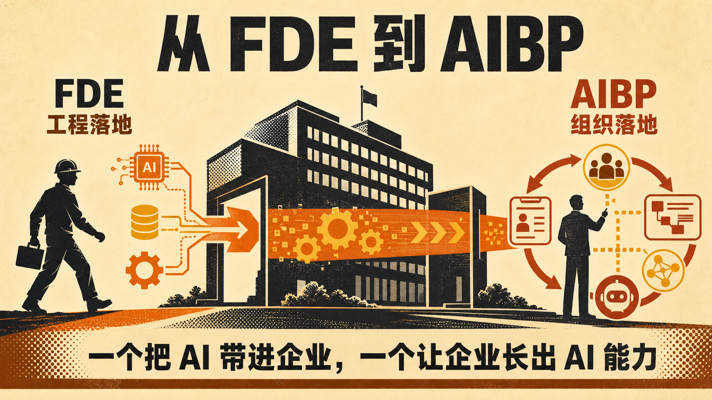

企业 AI 落地最近出现一个新的角色变化，从早期依赖 FDE 进入现场攻坚，逐渐走向由 AIBP 深入业务、持续推动组织改造。

一个解决 AI 如何进入企业，一个解决企业如何持续长出 AI 能力。

过去一年，FDE 成为企业 AI 落地中的关键角色。因为真实项目从来不是接一个模型、做一个 Demo 那么简单。数据散落在 ERP、CRM 和知识库里，权限、合规、审批、隐性规则层层交织。很多需求甚至要等系统跑起来、用户开始抱怨，才逐渐看清。

这时候，需要有人同时懂业务、模型和工程，在一线把模糊问题变成可运行的系统。FDE 并不是换了名字的驻场外包，它更像产品经理、工程师和实施顾问的混合体，解决的是 AI 系统如何进入企业。

但系统上线之后，更难的问题才刚出现。

员工为什么不用？哪些动作可以交给 Agent，哪些必须由人确认？提效之后，岗位和流程怎么调整？一个部门做出的能力，如何复用给其他部门？如果提示词、评测集、知识结构和运维方法都留在供应商手里，企业得到的仍然只是 AI 服务，不是自己的 AI 能力。

当 AI 落地从一个项目变成持续的业务改造，企业就需要一个长期留在业务现场、对结果负责的角色。AIBP 可以类比 HRBP。HRBP 把组织与人才能力带进业务，AIBP 则把 AI 能力带进业务，推动人、流程、数据和 Agent 重新组合。

我把 AIBP 理解为嵌入业务部门的 AI 转型负责人。它不负责到处教人写提示词，也不以做了多少个 Agent 为成绩。它真正要负责的是，找到值得重构的工作，并用业务周期、成本、质量、收入和采用率证明结果。

所以，从 FDE 到 AIBP 并不是岗位替代，而是企业 AI 从工程落地走向组织落地。

FDE 负责攻坚，平台团队负责沉淀共性能力，AIBP 负责发现机会、推动采用和持续运营。缺少任何一层都会失衡。只有 FDE，容易做出一堆没人用的 Agent。只有 AIBP，容易停在培训和需求收集。

我认为企业 AI 的竞争，最后拼的不是模型采购能力，而是组织改造能力。真正稀缺的人，也未必是最会写提示词的人，而是既能获得业务团队信任，又能与工程团队对话，还愿意对业务结果负责的人。

如果让你在团队里先补一个角色，你会选负责技术攻坚的 FDE，还是负责组织改造的 AIBP？为什么？

## 质检报告

**L1 硬性规则** ✅
- 禁用词、禁用标点、结构套话、表演式话术均为零命中
- 正文无列表化表达，段落结构清晰
- 长度符合约 800 字社交博文要求

**L2 风格一致性** ✅
- 开头使用对照判断建立钩子
- 每段推进一个信息单元，核心分工明确
- 具体系统、角色边界和业务指标支撑观点

**L3 活人感** ✅
- 有明确的个人判断，不编造经历和数据
- 结尾用具体角色选择引导互动

**总评**：3 层全部通过
