# 微博正文 - 微博

返回

数字生命卡兹克

公开

为了不花那120刀，我把电脑清理软件做成了开源skill。

这两天干了一个我觉得还挺有意思的事，虽然很小，但是我也想写下来，因为感觉它可以非常非常直观的让大家感受到。

AI时代，Agent对于传统应用的冲击。

故事是这样的。

前天我在推上刷到了一条帖子，X上有位老哥分享了一条prompt。

就这么一句话。do a FULL read only analysis on my Macbook to help me optimize storage。

大概意思是他让Codex对他的MacBook做一次全面的只读存储分析。

然后他发现可以清出500G的空间，Codex还找到了一个116G大的codex-tui.log文件。。。

正好我当时这台MacBook Air赔了我快2年的时间，装了一堆乱七八糟的东西，我就想着，要不要我给我的电脑也试试查一下，看看有没有啥可以删掉的垃圾文件。于是我当场就把原Prompt丢给我的Codex试了一下，然后加了一句用中文回答。

而Codex，给出了这样的结果。先不说其他的，不扫我都不知道，我发现电脑上竟然有快100个G的B站视频？？？我都懵了。

而且还藏在一个相当深的Containers目录下面。我去B站客户端里翻了一下，发现是我为了坐飞机上的时候有东西看，下载了一堆以为会看的动漫、纪录片还有乱七八糟的各种视频。然后每次在飞机上都直接昏睡过去，几乎没有真的看过。。。

然后，他们就默默的留在了哪里，我甚至都忘了，我还有B站客户端这回事，更忘了，这里面还有我的缓存视频。。。

然后是Chrome、开发、Claude环境balbalabla。Codex最后给了一个判断，按这个清单清，保守能腾出120G，激进一点能到140G以上。

我不知道大家，反正我自己是个强迫症，是个洁癖。就是我就喜欢电脑干干净净的，垃圾能删就删。

而且在之前，Mac系统清理垃圾，是一件特别恶心的事情，我还记的我17年刚上班的时候，当时为了清理Mac的垃圾，找到了一个软件，叫ClaeanMyMac。

这玩意不是免费用的，正版一年近40刀，一次买断要120刀。当时刚毕业你让我买这个，我真的是掏不起，然后就满大街的搜破解版，然后功能又不全。

可以说，到了今天，清理Mac的垃圾，都没有一个很好用的产品。Windows生态也差不多，有多少装安全管家或者360，其实就是为了清垃圾的，可以举个手。。。但是现在，好像，Agent就能直接干了啊。

本身你直接清理电脑垃圾也就是包装了一层UI，然后对我电脑底层进行扫描和操作，那我让Agent直接操作，岂不是更牛逼一点？说干就干。

不过原版prompt其实有个问题，它只是一个比较专业一点的只读文档，然后给你列了一个占用清单，又给了一些不太清楚的清理建议。

对没太熟悉系统的朋友，看完整份报告，其实还是会不太敢动手。哪些能放心清，哪些得自己看一眼再判断一下，哪些绝对千万别碰，这些判断它没有帮你直观清晰地列出来。而且他也没法帮你删东西。

所以我想，要不然，圆一下我9年轻的梦，直接干脆自己搓一个skill，来解决清理电脑垃圾的需求？

说干就干，大概烧了一些Token之后，这个清理垃圾.skill，就顺利面试了，而且，Mac和Windows都能用。

同样，老规矩，也已经开源在我自己GitHub上的skills仓库了。

 [网页链接](https://github.com/KKKKhazix/khazix-skills?mark_id=999_reallog_mark_ad%3A999%7CWeiboADNatural)

我在我的MacBook Air上跑了一下，给大家看一下效果比如说一句帮我看看存储，它就可以自动触发了。

它会先找你要权限，然后扫描你电脑上面的文件，然后直接在浏览器里打开一份可交互的HTML报告，帮助你可以化的了解，同时，你也可以直接在网页上点按钮清理。就这么简单，但是究极实用，而且效果甚至比收费的专业清理软件效果还要好。。。

而且速度也不错，几分钟就跑完了。

最终的网页是这样的。第一部分是磁盘总览。总容量多少，用了多少，还剩多少，可以通过一条彩色进度条方便直观看到。

同时因为后续要给出清理命令，所以他会去扫描你电脑的系统环境。接着是占用排行Top 5。

和上面prompt分析的结果一样，B站离线下载缓存96.7个G排第一，然后Google Chrome应用数据等等等等。

每一项都有颜色标签、类型、完整路径和一句话说明。再往下是执行建议，帮你排好了清理的优先级。性价比最高的是去B站客户端清看完的离线视频。然后跑绿灯纯缓存命令，合计约27个G。

这里虽然给了清理执行建议，但是你可能还不知道要怎么去清理。这就是随后的三色分级详情区用来做的事情，也是整个skill最核心的部分。

🟢 绿灯，可以放心让agent帮你清理。这类东西寄都全是纯缓存、临时文件、安装包残留，垃圾大户，不影响任何功能。每项都可以展开。

展开之后路径、清理前要不要关进程、清理命令全列好了，每条命令旁边有复制按钮，你想去复制自己运行的，你也可以自己去运行着玩。

但是我们也贴心的在下面也设计了两个操作按钮，移到废纸篓和直接删除。无论你点哪一个键，它都会有一个弹窗跟你进行二次确认。

移到废纸篓是可逆的，删错了能捞回来。直接删除立即释放空间但不可恢复。你就自己选择就行。比如我这里点移到废纸篓，然后点确定。这几个安装包就会被移到我的废纸篓里面去了。然后这一项在网页上，也会实时更新，被标记为已清理。如果不想逐项清理的话，你也可以直接点击右上角，一键把这些绿灯文件移到废纸篓，或者是一键删除。

🟡 黄灯文件，是我们建议你自己看一眼再决定的。这类东西需要人去把关，比如B站缓存的视频、下载文件夹里的安装包、某个项目文件夹。

agent会告诉你它是什么、为什么建议你看一眼、删了有什么影响，最终你自己拿主意。黄灯项不会给你直接删除的按钮，只给在访达中打开让你自己去看，你确定了以后手动去删。有安全子路径的会额外给一个移到废纸篓，但也只是移到废纸篓，可逆的。

比如这里没有用的B站视频，它会建议我去b站应用里面删视频。

当然，你也可以快捷打开访达（就是Mac的文件夹），直接跳到那个地方，然后手动山东。

也提供了一个移到废纸篓选项，这里的仅安全部分，它也会解释是经过核实过可安全清理的子目录。因为这个文件夹下面除了视频，还保留了我的登录派和设置，所以是不能完全删除的。点这个键，它会只删除视频，而保留我的B站登录态和设置，这也是我们的一些小小体验设计。

🔴 红灯里就是一些比较重要的文件。比如系统文件、正在使用的应用核心数据、sleepimage这些，agent会解释为什么不能动，然后跳过清理。

如果你非要清理的话，那他也给你提供了一键在访达中访问的按钮，点一下就能找到这个应用了。最后是长期优化建议，这里面的一些建议，我觉得还是值得一看的。

整个skill全程只读，扫描阶段禁止任何写操作。只有你在报告页面上主动点了删除之类按钮，浏览器弹出确认框，你再点一次确认，才会真正执行清理操作。

我自己一直的原则是，对待AI，还是需要谨慎一点，稍微花点时间确认一下，虽然现在在代码层面，这种小东西幻觉率已经极低了，但还是防一手。给大家看看我清完之后的内存。直接清理掉了了快120个G。。。

就像我前面说过的，这个skill它是不挑电脑环境，也不挑你的Agent工具。所以我也拿同事的Windows电脑的Codex试了一下。

给大家放一下效果。欢迎大家试试，如果跑出来了什么有意思的发现，也欢迎来评论区分享，我很好奇大家的电脑里有没有像我一样藏了些奇奇怪怪的东西。也再次提醒一下大家，删东西一定要慎重慎重再慎重。

当然我知道，肯定很多人也好奇，这种Agent+skill的方式来清垃圾，跟之前的专业清理软件比，效果到底怎么样。所以呢，为了方便对比，在用这个skill清理内存前，一开始我就专门在我的MacBook Air上同样拿CleanMyMac扫了一遍。

跑了快半小时才出结果，扫出了15.8G的垃圾可清理。点进垃圾清理是这样的。

左边把垃圾分成了几个大类，系统垃圾里面也给你分好了文件的种类。但是这些信息并不足够让我做决定。比如这个Google Chrome 3.8G的文件夹，他告诉我，这是用户缓存文件，属于系统垃圾，可以删。

但是我其实并不知道这个文件里面到底是什么内容。这3.8个G里有多少是Service Worker离线缓存，扩展数据，或者IndexedDB，清完之后哪些网站要重新登录、哪些离线功能会失效。我全都不知道。

那作为一个普通用户，我只能单凭他说的用户缓存文件，相信他，让他删了。而且他只能扫描到传统意义上的垃圾文件，扫不到我瞎下的b站视频，因为他不能像agent一样去读到每个文件的内容。

相比起来，Agent给的信息比CleanMyMac细多了，也透明多了，每一项都有具体路径、具体大小、具体说明，告诉你这个文件夹是干嘛的、删了会怎样、建议你怎么操作。这个能力，现在一个skill就能做到了。

而且做得更透明、更灵活、可以根据你的具体情况定制。在我的skill之上，进一步，你想让他找哪种想清理的文件都可以大白话跟他说，CleanMyMac做不到这种程度的个性化，因为它是一个写死了规则的软件，而Agent能理解你的各种奇奇怪怪的需求。

我不是说CleanMyMac不好。

但其实你可以发现，这类工具型软件，在Agent时代，确实正在遭受冲击。我之前写过一篇文章叫AI正在吞噬所有软件，里面有一个判断，软件正在从资产变成耗材。

还有，软件的本质就是人和机器之间的翻译层，而Agent正在填平这道鸿沟。

两个月，这个清垃圾的小skill，其实就可以验证了。

我自己的电脑里，在很久很久以前，其实还装过很多工具类的软件。解压缩的、PDF编辑的、图片格式转换的、文件重命名的、重复文件查找的……

这些软件的共同点是它们都在执行一个相对明确的、规则可定义的任务。

而这恰恰是Agent最擅长的事。

所以那些曾经靠一个明确功能养活团队的软件公司，它们面对的竞争对手已经不是另一家软件公司了，而是用户手里的一条prompt，是Agent的一个skill。

这个skill今天能清垃圾，明天能做什么，那谁知道呢。

反正我挺期待的。

这个有趣的未来。

[#how i ai#](https://s.weibo.com/weibo?q=%23how%20i%20ai%23) [#ai创造营#](https://s.weibo.com/weibo?q=%23ai%E5%88%9B%E9%80%A0%E8%90%A5%23)

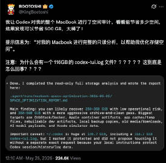 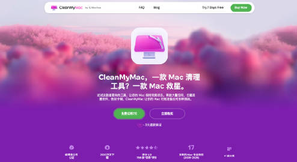 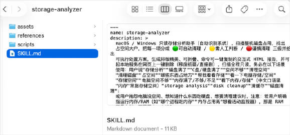 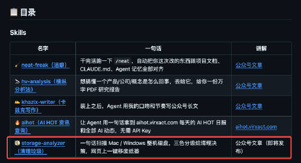 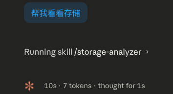 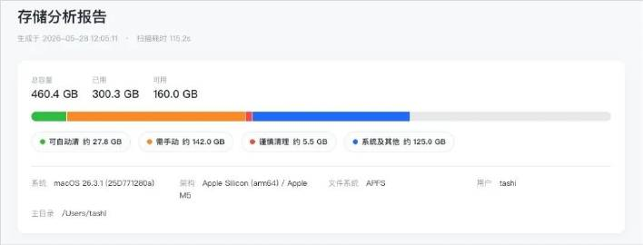 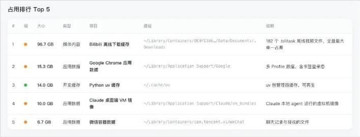 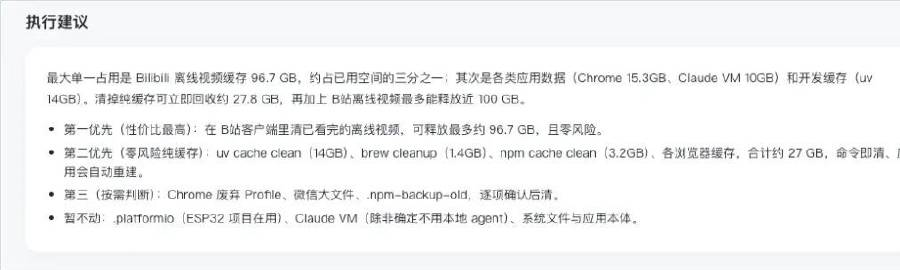 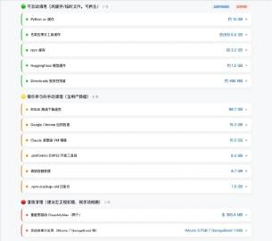 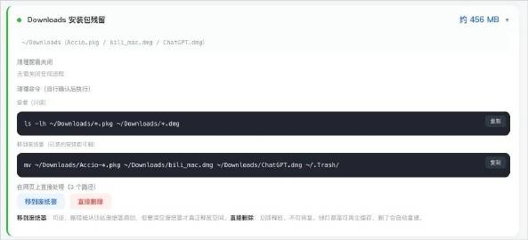 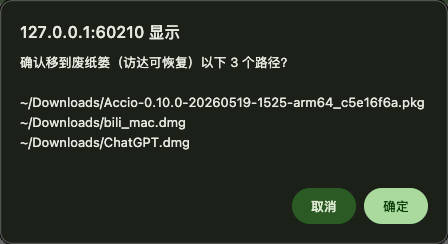 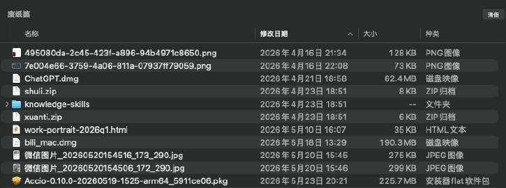 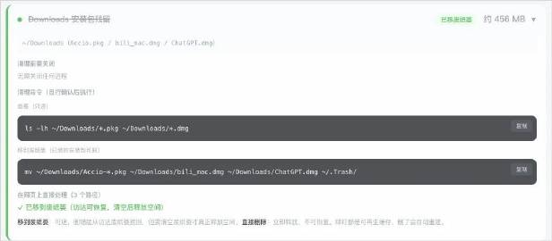 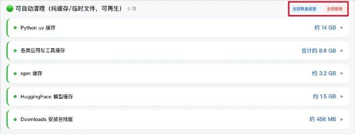 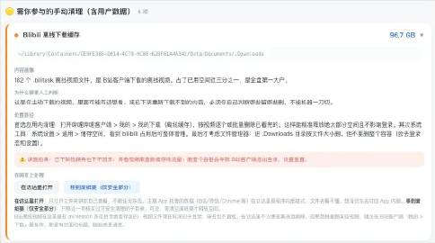 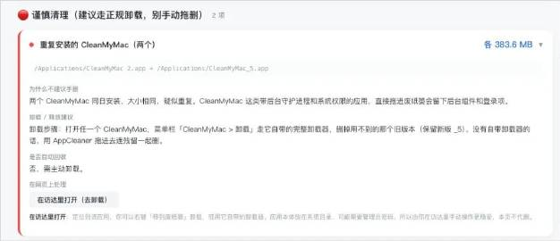 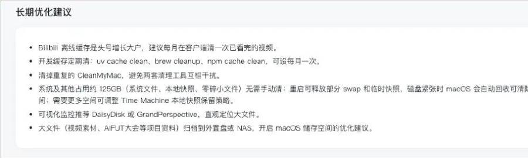 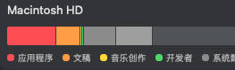
