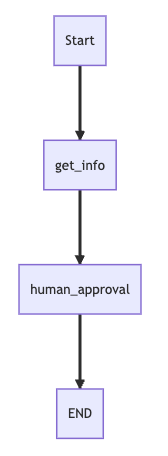
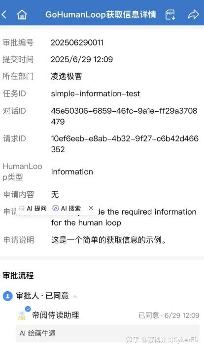
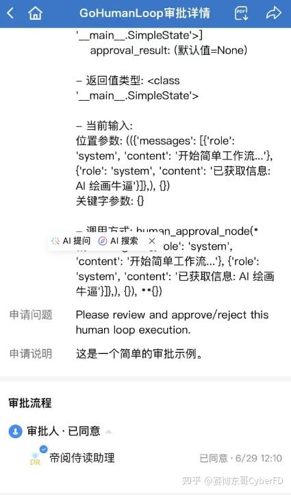
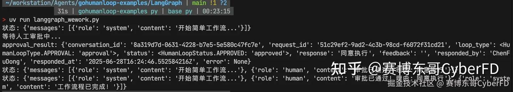

# 使用GoHumanLoop将你的AI Agent在企业微信建立人机协同（二）

## 一. 前言

昨天已经发布了一篇，如何通过`GoHumanLoop-WeWork`配置好链接企业微信和你AI Agent的服务端功能。今天我们就一起看一下在 AI Agent 框架中如何使用`GoHumanLoop`库与`GoHumanLoop-WeWork`对接，彻底打通 AI Agent 到企业微信的审批流程！

这是`GoHumanLoop`系列的第四篇文章，之前文章如下：

感兴趣的朋友可以前往阅读

## 二. LangGraph 简单示例

我编写一个最小化的AI Agent，并且使用`GoHumanLoop`库，增强`Human-in-the-Loop`功能。

先看一下代码

```
# /// script
# requires-python = ">=3.10"
# dependencies = [
# "gohumanloop>=0.0.11",
# "langgraph>=0.4.7",
# "langchain-openai>=0.3.12"]
# ///

"""
LangGraph 与 WeWork企业微信 简单集成示例

这是一个最小化示例，展示如何在 LangGraph 中使用 LangGraphAdapter和 APIProvider与企业微信进行人机交互。
将你的 AI Agent 链接到企业微信审批流程中。

配置：
- API 地址: https://your-api-endpoint/api
- API KEY: 通过API接口获取

前置条件：需要根据GoHumanLoop-WeWork配置好企业微信审批应用和服务
详情见：https://github.com/ptonlix/gohumanloop-wework
"""

import os
import time
from typing import TypedDict, List, Dict
from dotenv import load_dotenv

# 导入 LangGraph 相关库
from langgraph.graph import StateGraph, END

# 导入 GoHumanLoop 相关库
from gohumanloop.adapters.langgraph_adapter import HumanloopAdapter
from gohumanloop.core.interface import HumanLoopStatus
from gohumanloop import DefaultHumanLoopManager, APIProvider
from gohumanloop.utils import get_secret_from_env

import logging

logging.basicConfig(level=logging.INFO)

# 设置环境变量
os.environ["GOHUMANLOOP_API_KEY"] = "<已脱敏：请从环境变量或接口获取>"

# 定义简单状态类型
class SimpleState(TypedDict):
    messages: List[Dict[str, str]]

# 创建 GoHumanLoopManager 实例
manager = DefaultHumanLoopManager(
    APIProvider(
        name="ApiProvider",
        api_base_url="https://<your-api-endpoint>/api", # 换成自己企业微信的URL
        api_key=get_secret_from_env("GOHUMANLOOP_API_KEY"),
        default_platform="wework"
    )
)
# 创建 LangGraphAdapter 实例
adapter = HumanloopAdapter(
    manager=manager,
    default_timeout=300,  # 默认超时时间为5分钟
)

# 定义需要获取人工信息的节点
@adapter.require_info(
    task_id="simple-information-test",
    additional="这是一个简单的获取信息的示例。",
)
def get_information_node(state: SimpleState, info_result={}) -> SimpleState:
    """获取信息的节点"""
    print("获取人工信息...")
    print(f"info_result: {info_result}")

    state["messages"].append({
        "role": "system",
        "content": f"已获取信息: {info_result.get('response')}"
    })

    return state

# 定义需要人工审批的节点
@adapter.require_approval(
    task_id="simple-approval-test",
    additional="这是一个简单的审批示例。",
    execute_on_reject=True,
)
def human_approval_node(state: SimpleState, approval_result=None) -> SimpleState:
    """需要人工审批的节点"""
    print("人工审批完成中...")

    print(f"approval_result: {approval_result}")
    # 处理审批结果
    if approval_result:
        status = approval_result.get("status")
        response = approval_result.get("response", {})

        if status == HumanLoopStatus.APPROVED:
            state["messages"].append(
                {
                    "role": "human",
                    "content": f"审批已通过！理由: {response}",
                }
            )
        elif status == HumanLoopStatus.REJECTED:
            state["messages"].append(
                {
                    "role": "human",
                    "content": f"审批被拒绝。理由: {response}",
                }
            )

    return state

def final_node(state: SimpleState) -> SimpleState:
    """最终节点"""
    state["messages"].append({"role": "system", "content": "工作流程已完成！"})
    return state

# 构建工作流图
def build_simple_graph():
    """构建简单工作流图"""
    graph = StateGraph(SimpleState)

    # 添加节点
    graph.add_node("get_info", get_information_node)
    graph.add_node("human_approval", human_approval_node)
    graph.add_node("final", final_node)

    # 设置边
    graph.add_edge("get_info", "human_approval")
    graph.add_edge("human_approval", "final")
    graph.add_edge("final", END)

    # 设置入口
    graph.set_entry_point("get_info")

    return graph.compile()

# 运行工作流
def run_simple_workflow():
    """运行简单工作流"""
    with adapter:
        # 构建工作流图
        workflow = build_simple_graph()

        # 初始化状态
        initial_state = SimpleState(
            messages=[{"role": "system", "content": "开始简单工作流..."}],
        )

        # 运行工作流
        for output in workflow.stream(initial_state, stream_mode="values"):
            print(f"状态: {output}")

            # 等待一下，便于观察
            time.sleep(1)

# 主函数
if __name__ == "__main__":
    # 加载环境变量
    load_dotenv()

    # 运行工作流
    run_simple_workflow()
```

上述代码使用LangGraph框架，整个工作流比较简单，如下图所示：



工作流

1\. `get_info`节点，模拟通过`GoHumanLoop`连接企业微信获取到审批人提供的外部输入信息

2\. `human_approval`节点，模拟Agent在执行中需要审批的执行操作

```
# 创建 GoHumanLoopManager 实例
manager = DefaultHumanLoopManager(
    APIProvider(
        name="ApiProvider",
        api_base_url="https://<your-api-endpoint>/api", # 换成自己企业微信的URL
        api_key=get_secret_from_env("GOHUMANLOOP_API_KEY"),
        default_platform="wework"
    )
)
```

代码中，定义了`APIProvider`构造了默认HumanLoopManager，这个`APIProvider`就是对接到企业微信中部署的`GoHumanLoop-WeWork`服务。用来发送请求和接收审批结果

```
# 创建 LangGraphAdapter 实例
adapter = HumanloopAdapter(
    manager=manager,
    default_timeout=300,  # 默认超时时间为5分钟
)

# 定义需要获人工信息的节点
@adapter.require_info(
    task_id="simple-information-test",
    additional="这是一个简单的获取信息的示例。",
)

# 定义需要人工审批的节点
@adapter.require_approval(
    task_id="simple-approval-test",
    additional="这是一个简单的审批示例。",
    execute_on_reject=True,
)
```

`LangGraphAdapter`定义了适配`LangGraph`框架的适配对象，该对象的两个装饰器方法分别来封装到各自的节点中来说实现控制节点获取信息和审批操作。

## 三. 示例展示

运行示例代码

```
uv run langgraph_wework.py
```

企业微信展示



获取信息

通过企业微信我们就能给 Agent智能体 随时输入必要的信息啦～



审批详情

随后就是进行审批操作，通过企业微信随时异步就能批准 Agent 智能体 的重要操作



Agent运行完成

运行完成～

## 四.总结

以上就是使用`GoHumanLoop`和`GoHumanLoop-WeWork`搭配使用，快速拓展你的Agent智能体边界，发挥更大 AI效能
更多信息欢迎你前往查看相关代码仓库

-   [GoHumanLoop](https://link.zhihu.com/?target=https%3A//github.com/ptonlix/gohumanloop): Perfecting AI workflows with human intelligence
-   [gohumanloop-examples](https://link.zhihu.com/?target=https%3A//github.com/ptonlix/gohumanloop-examples) : GoHumanLoop使用示例仓库
-   [gohumanloop-wework](https://link.zhihu.com/?target=https%3A//github.com/ptonlix/gohumanloop-wework) GoHumanLoop企业微信服务示例仓库

欢迎您的 Star ～

