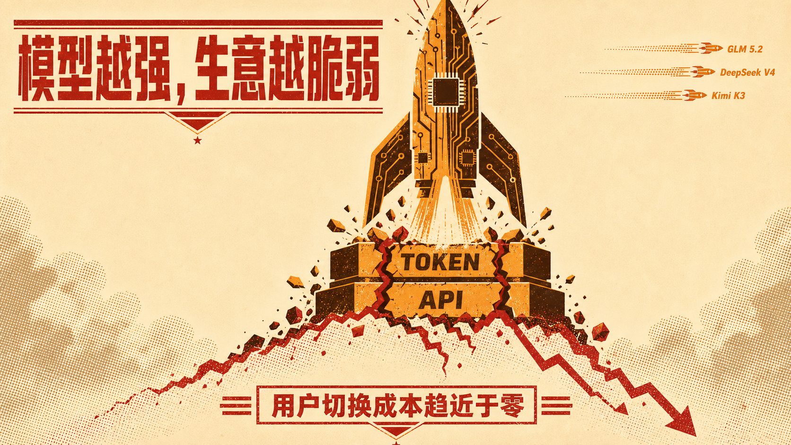
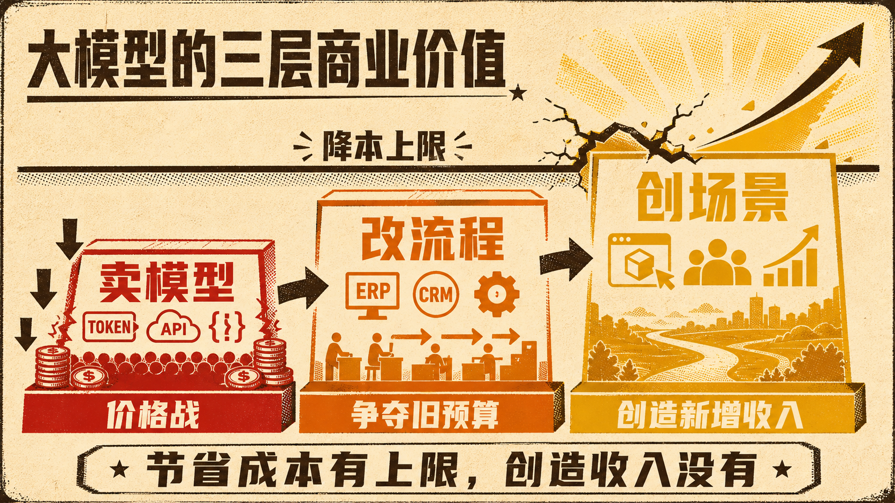

Kimi K3 很强，我来个反调, 看空大模型这门生意。

不是 K3 不够好，恰恰是因为它太好了。几周前，开源社区还在追捧 GLM 5.2，再往前是 DeepSeek V4，现在又轮到 K3。模型能力不断刷新，用户迁移却只需要换一个 API，甚至只是改几行配置。

模型越惊艳，模型公司的护城河反而越可疑。

今天的王者，可能几周后就变成备选。用户不忠诚，也没必要忠诚，他们永远会追逐更强、更快、更便宜的模型。于是 MaaS 被卡进一个很难解的商业死局。收入端不断降价，成本端却要持续投入天价算力，上一代训练成本还没收回来，下一代又必须开工。

所以我怀疑，单纯出售 token 和 API 的 MaaS，核心商业逻辑正在失效。模型能力会越来越像云计算里的标准资源，有价值，但很难长期享受高溢价。

但我不认为，把模型嵌进 ERP、CRM 和原有流程，帮企业降本增效，就算找到了大模型的好生意。这类改造仍在优化旧流程、争夺旧预算，项目做得再深，很多时候也只是更聪明的软件外包。

大模型真正的价值，不该只是把旧生意做得更省，而是创造过去无法成立的新场景，改变企业怎么收费、获客和交付。只有客户因此获得新的收入来源，企业才愿意拿新增收入，而不是有限的 IT 预算买单。

节省成本有上限，创造收入没有。

卖模型，客户随时能换。改流程，客户只会拿投入产出比来压价。只有共同创造新的商业模式，价值才不再由 token 成本决定。

大模型的 Capex 军备竞赛也许还不会马上结束，但资本市场迟早会追问一个更现实的问题。烧掉这么多钱，到头来卖的究竟是不可替代的能力，还是越来越便宜的算力商品？

## 质检报告

**L1 硬性规则** ✅
- 正文禁用词、禁用标点、结构套话与表演式话术均为零命中
- 具体模型名称完整，正文约 550 字，段落结构通过

**L2 风格一致性** ✅
- 开头直接给出反常识判断，对照金句明确
- 短段落推进，信息密度与口语感通过

**L3 活人感** ✅
- 观点鲜明，从模型商品化推进到旧流程改造的价值上限
- 结尾落在资本回报问题，没有模板式互动

**总评**：3 层全部通过
