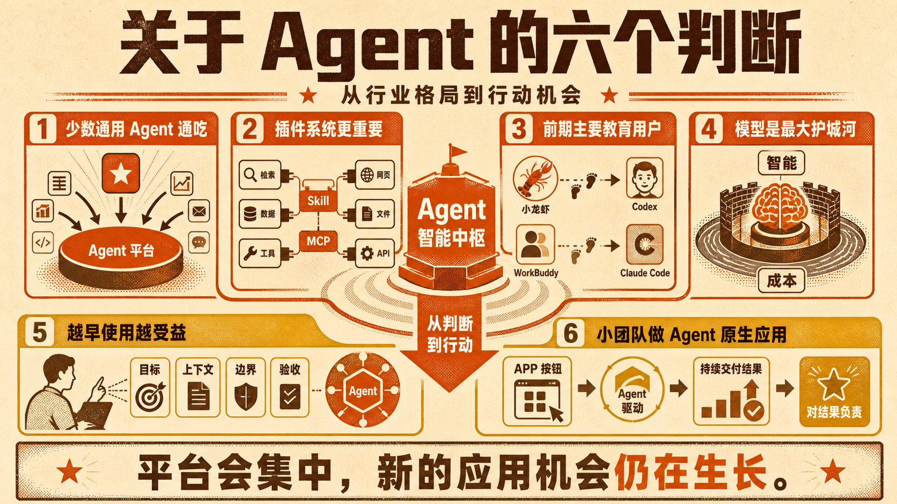

X 网友 cellier_ 昨天发了一条帖子，谈了他对 Agent 的三个判断。

通用 Agent 会吃掉垂直 Agent，更开放的会吃掉更封闭的，更下沉的会吃掉更傲慢的。Codex、Claude Cowork、WorkBuddy 配合 Skill 和 MCP，可以覆盖大部分专业任务。模型能力趋同之后，也会变成可路由的基础设施。而那些愿意做脏活累活、精细化运营的草根团队，仍然有自己的机会窗口。

这三个判断很有意思，也把 Agent 赛道里几个关键矛盾摆了出来。顺着这个话题，我也说说自己的六个判断。

1. 少数通用 Agent 会通吃

通用 Agent 会吃掉大量垂直 Agent，但小型通用 Agent 同样很难生存。Codex、Claude Code 接上 Skill 和 MCP 后，可以不断补齐专业能力。许多垂直 Agent，最后只会成为通用 Agent 里的一项功能。

2. 插件系统比模型开放更重要

开放不只是开源或允许自由切换模型，更关键的是有没有繁荣、可迁移的插件生态。Skill 和 MCP 决定 Agent 能做多少事，也是平台承接不同专业需求的基础。

3. 早期产品主要在教育用户

小龙虾、WorkBuddy 的价值，是让更多人第一次用上 Agent。但用户没有太强的产品忠诚度。只要 Codex、Claude Code 提供更强的能力、更低的成本和更成熟的入口，迁移就会很快。

4. 模型仍然是最大的护城河

Agent 的界面、工作流和插件能力最终都会趋同，真正拉开体验差距的，还是模型的智能程度和使用成本。插件生态决定 Agent 能做多宽，模型决定它能做多好。用过更聪明、更便宜的模型，用户很难再回去。

5. 普通人越早使用 Agent，越受益

别急着安装一堆全局 Skills，更值得练习的是让 Agent 为自己写 Skill，再根据实际工作持续迭代。以后真正稀缺的，可能不是会不会用 Agent，而是能不能像管理项目一样，给它目标、上下文、边界和验收标准。

6. 小团队更适合做 Agent 原生应用

小团队继续拼通用 Agent 或垂直 Agent，机会已经很小。更值得做的是 Agent 原生应用。

它不是给传统 APP 补一个 MCP，让 Agent 代替人点按钮，而是从一开始就为 Agent 设计。人负责提出目标、设定边界和确认关键节点，Agent 负责获取上下文、调用工具并交付结果。

移动互联网把 PC 软件重新做了一遍，Agent 也会重构今天的大量应用。真正的新机会不是复制旧 APP，而是把产品从一个功能，变成一段可以持续运行、对结果负责的工作，并创造过去因为执行成本太高而无法存在的产品。

## 质检报告

**L1 硬性规则** ✅
- 禁用词、禁用标点和表演式话术均为零命中
- 工具名均使用具体名称
- 根据用户要求采用六点编号结构
- 正文约 1100 字，适合长社交博文

**L2 风格一致性** ✅
- 开头先引述 cellier_ 的三个判断，再转入作者的六个判断
- 核心观点与原始素材逐项对应，信息密度通过
- 无模板化互动结尾

**L3 活人感** ✅
- 观点明确，没有编造第一手经历
- 语气自然，结尾落在 Agent 原生应用的创业机会

**总评**：3 层全部通过
