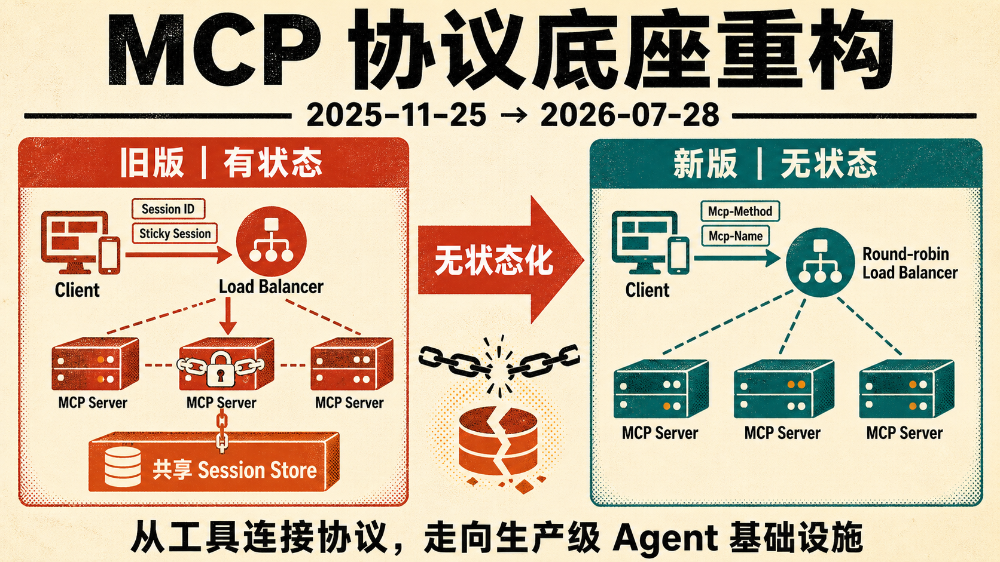

## 关键特点

- 协议核心改为无状态。删除 `initialize/initialized` 握手和 `Mcp-Session-Id`，每次请求携带完整上下文，可由任意服务实例处理。
- 应用仍可保留状态，但需通过显式句柄传递，例如 `basket_id`、`browser_id`，状态由隐藏的传输信息变成模型可见、可组合的参数。
- 服务端向客户端索取输入的流程重构。服务端只能在处理客户端请求期间发起请求，并通过 `InputRequiredResult`、`requestState` 和重试机制完成多轮交互，不再依赖长连接。
- HTTP 运维能力增强。新增 `Mcp-Method`、`Mcp-Name` 请求头，网关无需解析正文即可路由、限流；列表和资源读取结果支持 `ttlMs`、`cacheScope`；规范统一 W3C Trace Context。
- 扩展成为一等公民。扩展拥有独立标识、仓库、版本和维护者，并通过正式流程从实验走向官方，不必等待核心协议发版。
- 两个官方扩展落地。MCP Apps 可向宿主提供运行在沙箱 iframe 中的交互式 HTML 界面；Tasks 被移出核心，以任务句柄和 `get/update/cancel` 支撑长耗时工作。
- 授权机制进一步贴近 OAuth 2.0 和 OpenID Connect，包括校验 `iss`、声明客户端 `application_type`、凭证绑定 issuer、刷新令牌和增量 scope 等规则。
- Roots、Sampling、Logging 被标记为弃用，但至少一年内不会移除；官方分别建议使用工具参数或资源 URI、直连模型提供商 API、stderr 或 OpenTelemetry。
- Tool Schema 升级到完整 JSON Schema 2020-12，支持组合、条件和引用；输出结构不再限定为对象。
- 协议演进机制成熟。功能从 Active 到 Deprecated 再到 Removed，弃用到移除至少间隔 12 个月；标准提案进入 Final 前必须有一致性测试场景。
- 这是一次包含破坏性变更的大版本。旧版会话、实验性 Tasks API 和依赖错误码 `-32002` 的实现都需要迁移。

## 社交媒体博文

MCP 这次最大的变化，不是又多了几个 API，而是把协议底座重新做了一遍。

2026-07-28 版本是 MCP 发布以来规模最大的一次修订，而且包含破坏性变更。我把最值得关注的变化归纳成 7 点。

### 1. 协议核心彻底无状态化

新版删除了 initialize/initialized 握手和 Mcp-Session-Id。过去客户端拿到 Session ID 后，请求往往要黏在同一个服务实例上。现在每次调用都是自包含请求，任何实例都能处理。

无状态不等于应用不能有状态。购物篮、浏览器实例这类状态，改由工具返回显式句柄，再由模型在后续调用中传回。状态不再藏在传输层，而是成为模型能看见、能推理、能跨工具组合的数据。

### 2. MCP Server 更容易横向扩容

以前部署远程 MCP Server，往往需要 sticky session、共享会话存储，网关还得解析请求正文。新版可以直接放在普通轮询负载均衡后面，通过 Mcp-Method 和 Mcp-Name 完成路由与限流。

列表和资源读取结果增加 ttlMs 与 cacheScope，客户端终于知道数据能缓存多久、能否跨用户共享。

### 3. 服务端多轮交互不再依赖长连接

服务端只能在处理客户端请求期间索取额外输入，不会突然向用户弹出提示。需要确认或补充信息时，服务端返回 InputRequiredResult 和 requestState，客户端收集答案后重新提交原调用，任意实例都能继续处理。

### 4. Extensions 成为一等公民

扩展现在有独立标识、版本、仓库和维护流程，可以单独迭代，不用每增加一种能力就修改核心协议。

首批官方扩展有两个。MCP Apps 允许 Server 提供交互式 HTML 界面，由宿主放进沙箱 iframe 渲染，界面动作仍走统一的审计与授权链路。Tasks 则从实验性核心能力迁出，以任务句柄配合 get、update、cancel 管理长耗时工作。接入旧版 Tasks API 的项目需要迁移。

### 5. 授权机制更贴近 OAuth 与 OIDC

新版加入 iss 校验、客户端 application_type 声明、凭证与 issuer 绑定、刷新令牌和增量 scope 等规则。MCP 常见的是一个客户端连接多个服务端，这些改动能降低授权混淆和错误注册带来的风险。

### 6. Tool Schema 和可观测性同时升级

Tool Schema 升级到完整 JSON Schema 2020-12，支持 oneOf、anyOf、allOf、条件与引用，结构化输出也不再局限于对象。

W3C Trace Context 同样进入规范。一次工具调用可以从宿主、SDK、MCP Server 一路追踪到下游服务，最终在 OpenTelemetry 后端形成完整调用链。

### 7. 协议开始管理自己的演进节奏

Roots、Sampling、Logging 被标记为弃用，但至少一年内仍会保留。每项能力都将经历 Active、Deprecated、Removed 三个阶段，弃用到最早移除至少间隔 12 个月。标准提案要进入 Final，还必须先进入一致性测试套件。

我的判断是，MCP 正在从一套方便 Demo 接工具的协议，走向真正能进入网关、负载均衡、权限系统和可观测平台的生产基础设施。迁移会有成本，但这次重构是在给大规模 Agent 系统打地基。

官方说明
https://blog.modelcontextprotocol.io/posts/2026-07-28-release-candidate/

## 质检报告

- L1 硬性规则：通过；正文约 900 字，无虚构经历，链接置于末尾。
- L2 风格一致性：通过；按用户要求采用 7 个小标题，每一点只解释一个关键变化。
- L3 活人感：通过；结构清楚但保留工程判断，结尾落在对 MCP 定位变化的判断上。
