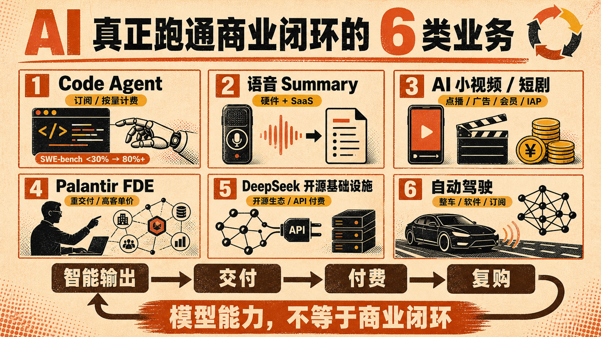

AI 看起来遍地开花，但真正跑通商业闭环的业务，其实仍然屈指可数。

这里说的闭环，不是有用户、能融资，而是产品能持续创造价值，客户愿意反复付费，收入还能覆盖模型、算力、获客和交付成本。

目前较清晰的主要有六类。

1. Code Agent

这是目前最成熟的 AI 垂直应用。SWE-bench 从 2024 年初不足 30% 提升到 2025 年超过 80%，证明模型已经能处理大量真实软件工程任务。更关键的是，它直接进入开发流程，价值可以用节省的工程时间衡量，再通过订阅和按量计费变现。

2. 语音 Summary

Plaud 已经跑通硬件加 SaaS 订阅，钉钉 A1 等大厂也在跟进。录音设备提供高频入口，转写、总结和知识管理提供持续服务，一次硬件销售最终变成长期订阅收入。

3. AI 小视频和短剧

这类业务跑通的是内容工业化。AI 降低视频生产成本，平台再通过付费点播、广告、会员和 IAP 等方式回收价值。只要内容能持续获得播放和付费，商业循环就能成立。

4. Palantir FDE 模式

Palantir 不只卖模型，而是派工程师深入政府和大型企业，把 AI 嵌入真实业务与决策链。它用高客单价合同覆盖重交付，再把经验复制到更多客户，形成高壁垒的企业服务闭环。

5. DeepSeek 式开源基础设施

开源模型免费扩大用户和开发者生态，API 与推理服务承接付费需求。它更像 AI 时代的基础设施生意。不过 V4 Flash 单日 Token 消耗和收入数字，目前仍需要更可靠的公开口径验证。

6. 自动驾驶

Tesla 等车企把神经网络装进真实车辆，收入来自整车、软件包和订阅。它的商业价值明确，但研发、监管和安全成本也最高，是资金与技术门槛最重的一条路线。

这六类业务有一个共同点。它们都有高频刚需、明确付费方和可量化价值，而且 AI 已经嵌入完整工作流或交易链。

模型能力不是商业闭环。只有当一次智能输出能够稳定变成一次交付、一次付费和下一次复购，AI 才真正从技术演示变成生意。

## 质检报告

L1 硬性规则 ✅

- 禁用词、禁用标点、结构套话、表演式话术均为零命中
- 正文按用户要求采用 1—6 编号，每类业务独立描述
- 具体产品与技术名称明确
- 数据口径不确定处已明确提示核验

L2 风格一致性 ✅

- 开头直接给出判断转向
- 六个独立信息单元层次清楚
- 每一点同时说明代表案例、付费方式与闭环逻辑

L3 活人感 ✅

- 有明确作者判断，不编造个人经历
- 结尾回到商业闭环的可验证标准
- 整体姿态克制，无宣传式口号

总评 3 层全部通过
