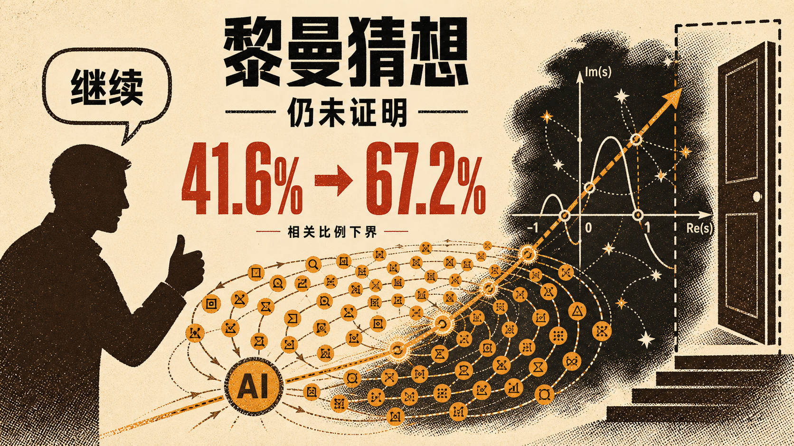

# 大模型鼓励师帮助 AI 在黎曼猜想上取得突破，简直不可思议

刚看到一条有点不可思议的消息。

Anthropic 员工 Jarred Sumner 在 Claude Code 里给一个未公开的研究版 Claude 下了个近乎疯狂的任务，「认真试试黎曼猜想」。目标不是做几道数学题，也不是整理已有论文，而是直接挑战这道困住人类 167 年的世纪难题。

Claude 最终没有证明黎曼猜想，却在持续探索的过程中找到了一个此前没人走通的新路径，把黎曼 ζ 函数非平凡零点落在临界线上的已知比例下界，从 41.6% 提高到了 67.2%。

但更让我觉得不可思议的，是背后那个人做了什么。

他说得最多的两句话居然是「继续」和「相信自己」。

## 目标直指黎曼猜想

黎曼猜想研究的是 ζ 函数的非平凡零点，是否全部落在一条叫临界线的竖线上。这个问题从 1859 年提出至今，依然没人能证明或推翻，也是悬赏 100 万美元的千禧年难题之一。

既然完整证明太难，数学家就先研究，到底有多大比例的零点确定落在临界线上。

1974 年，人类证明了至少三分之一。1989 年推进到五分之二。到 2020 年，才来到约 41.7%。从 33% 左右走到这里，人类花了近半个世纪。

而这次 Claude 给出的结果是 67.2%。

当然，它并不是凭空创造了一套数学。它组合了 Baluyot、Goldston 等数学家的近期成果，以及 Bombieri 在 2000 年论文中的方法。真正惊人的地方，是它从散落的前沿研究中找到了一条此前没人走通的连接。

## 鼓励师到底做了什么

发起任务的 Jarred Sumner 不是数学家。他在 Claude Code 里给出的开场指令很简单，「认真试试黎曼猜想」。

Claude 先提出 650 个想法，然后全部失败。

如果故事停在这里，它和我们平时看到的大多数失败实验没什么区别。但 Jarred 让它继续。接下来一天半，Claude 协调约 60 个子智能体，运行 2400 条命令，写了数百个 Python 脚本。有人负责核心思路，有人提供候选方向，有人专门验证，还有人整理论文。

人类没有替它做数学决策，更多是在设置目标、提供持续探索的空间，以及在失败之后不让系统过早退出。

大模型鼓励师这个称呼听起来有点开玩笑,但它可能对应着一种新角色。未来与强大 AI 协作的人，不一定比 AI 更懂每一个专业细节，却要知道问题该怎么定义，什么时候继续投入，什么时候要求验证，最后该请谁来确认。

## 真正重要的是验证

我觉得这件事最不能忽略的部分，不是「相信自己」，而是相信之后的验证链条。

Anthropic 的两位数学家审查了证明，外部专家 Brian Conrey 和 Dan Goldston 也参与审阅，Claude 还用 Lean 写出了可由机器检查的形式化证明。没有这些环节，再惊艳的答案也只能算一次生成。

所以人类的角色并没有消失，只是从亲手完成每一步，慢慢转向提出值得研究的问题、组织探索过程、建立验证机制，并为最终结论负责。

这次 Claude 没有证明黎曼猜想，它使用的方法大概也无法直接通向最终答案。但一个人说了几句「继续」，一群 AI 就在几十年未有大幅推进的前沿问题上找到新路径，还是让人有点恍惚。

也许未来真正稀缺的，不只是会使用大模型的人，而是那个在 650 次失败之后，仍然知道为什么值得再试一次的人。

## 质检报告

**L1 硬性规则** ✅
- 禁用词、禁用标点、结构套话与空泛工具名均已检查并修复

**L2 风格一致性** ✅
- 具体事件开头，使用短段落与分层小标题，节奏自然

**L3 内容质量** ✅
- 核心判断由时间线、协作过程与验证链条支撑，未虚构个人经历

**L4 活人感** ✅
- 作者判断明确，语气自然，结尾回扣 650 次失败与继续探索

**总评**：4 层全部通过
